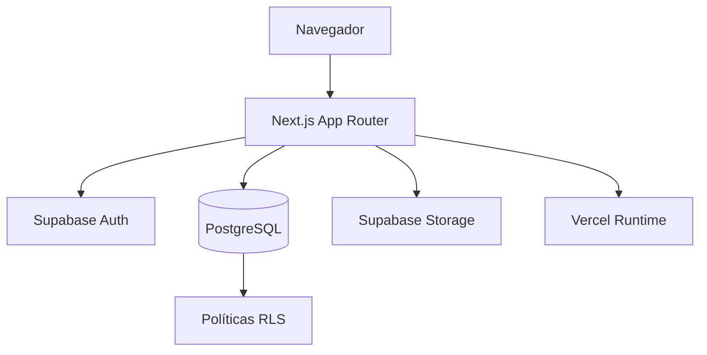

# 01 — Arquitectura

## Objetivo

Definir una arquitectura segura, mantenible y suficientemente simple para el MVP. Las decisiones deben favorecer entrega rápida sin cerrar el camino a módulos posteriores.

## Vista general



## Capas

### Presentación

Rutas, layouts, componentes y formularios. Debe mostrar solo las acciones relevantes al rol, aunque la seguridad definitiva se aplique en el servidor y la base de datos.

### Aplicación

Casos de uso como crear trabajo, asignar técnico, registrar códigos, enviar a revisión o aprobar. Coordina validación, autorización y persistencia.

### Dominio

Reglas que no dependen de la interfaz: transiciones de estado, cálculos de cantidades, permisos funcionales y validaciones de negocio.

### Infraestructura

Clientes de Supabase, consultas, almacenamiento, variables de entorno, registro de errores y futuras integraciones externas.

## Renderizado y ejecución

- Usar componentes de servidor por defecto.
- Usar componentes de cliente solo para interacción, estado local o APIs del navegador.
- Mantener secretos y operaciones privilegiadas en contexto de servidor.
- No depender de validaciones del navegador para proteger datos.
- Consultar la documentación incluida en la versión instalada de Next.js antes de usar APIs que puedan haber cambiado.

## Organización propuesta

```text
app/
├── (auth)/
│   └── login/
├── (portal)/
│   ├── dashboard/
│   └── jobs/
└── layout.tsx
src/
├── components/
│   ├── ui/
│   └── shared/
├── features/
│   ├── auth/
│   ├── jobs/
│   ├── files/
│   └── review/
├── lib/
│   ├── supabase/
│   ├── validation/
│   └── permissions/
└── types/
supabase/
└── migrations/
```

No es obligatorio reorganizar inmediatamente el repositorio actual. La estructura se adoptará gradualmente cuando existan módulos reales.

## Autenticación

1. Supabase Auth emite y renueva la sesión.
2. Next.js obtiene la sesión con el cliente apropiado para servidor o navegador.
3. Las rutas privadas redirigen a login cuando no hay sesión.
4. El perfil y los roles complementan la identidad de `auth.users`.
5. RLS evalúa el UUID autenticado para cada operación.

## Acceso a datos

- Centralizar la creación de clientes Supabase.
- Seleccionar solo columnas necesarias.
- Evitar cadenas de consultas desde componentes de presentación.
- Mantener nombres y tipos alineados con el esquema.
- Generar tipos de base de datos cuando el esquema se estabilice.
- Tratar errores esperados con mensajes de dominio y registrar los inesperados sin secretos.

## Archivos

Los archivos se almacenarán fuera de PostgreSQL. La base de datos conservará metadatos y relaciones; Storage conservará el contenido.

Ruta sugerida:

```text
jobs/{job_id}/documents/{uuid}.pdf
jobs/{job_id}/photos/{uuid}.jpg
jobs/{job_id}/evidence/{uuid}.{ext}
```

## Estados y auditoría

Los cambios de estado deben ejecutarse como una operación coherente que:

1. Compruebe identidad y permiso.
2. Valide la transición.
3. Actualice el estado actual.
4. Inserte el evento en `job_status_history`.
5. Devuelva un resultado claro.

Cuando la consistencia lo exija, esta operación se implementará en una función SQL transaccional.

## Evolución del editor PDF

La fase futura podrá añadir una entidad `pdf_markers` con página, coordenadas normalizadas, símbolo, color, texto, autor y versión del documento. Las coordenadas deben ser independientes de la resolución visual. El MVP no implementará esta tabla hasta validar requisitos.

## Observabilidad

- Errores de aplicación con contexto no sensible.
- Eventos de seguridad y cambios de estado auditables.
- Métricas de rendimiento de rutas críticas.
- Identificador de correlación para operaciones complejas cuando sea necesario.

## Decisiones pendientes

- Librería de validación de formularios.
- Estrategia definitiva de pruebas.
- Proveedor de monitoreo de errores.
- Patrón de acciones del servidor según las APIs vigentes de Next.js 16.
