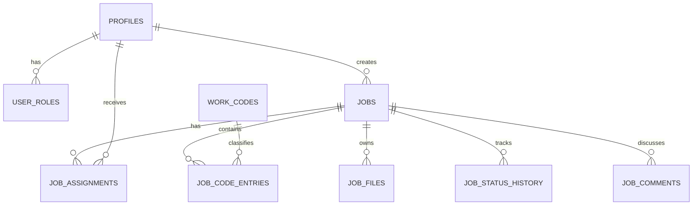

# 03 — Base de datos

## Principios

- PostgreSQL es la fuente de verdad.
- El esquema se modifica únicamente con migraciones versionadas.
- UUID para identificadores principales.
- Restricciones antes que validaciones duplicadas.
- RLS habilitada en tablas expuestas.
- Auditoría para acciones importantes.
- Fechas en UTC con `timestamptz`.

## Entidades

### `profiles`

Complementa `auth.users`.

Campos sugeridos: `id`, `first_name`, `last_name`, `display_name`, `phone`, `is_active`, `created_at`, `updated_at`.

### `user_roles`

Asigna uno o más roles. Campos: `id`, `user_id`, `role`, `is_active`, `created_at`, `created_by`. La implementación actual ya inició migraciones de roles y nombres de perfil.

### `jobs`

Registro principal. Campos sugeridos:

- `id`, `job_number`, `title`, `description`.
- Datos del cliente y ubicación según requisitos confirmados.
- `status`, `priority`, fechas previstas y reales.
- `created_by`, `created_at`, `updated_at`, `archived_at`.

`job_number` debe ser único y estable. El estado debe limitarse a valores permitidos.

### `job_assignments`

Relaciona técnicos y trabajos. Debe admitir historial de asignación mediante fechas o estado en lugar de sobrescribir sin registro.

### `work_codes`

Catálogo administrable: código, nombre, descripción, unidad, estado y orden.

### `technician_rates` y `client_rates`

Separan datos internos y comerciales. Deben soportar vigencia y evitar cambios retroactivos en trabajos ya aprobados. Puede ser necesario copiar la tarifa efectiva a la entrada del trabajo.

### `job_code_entries`

Registra `job_id`, `work_code_id`, técnico, cantidad, tarifa efectiva, notas, autor y fechas. Las cantidades deben usar `numeric`, no punto flotante.

### `job_files`

Metadatos: trabajo, bucket, ruta, nombre original, tipo, tamaño, categoría, autor, estado y fecha. El registro no debe convertir el bucket en público.

### `job_status_history`

Historial append-only: estado anterior, estado nuevo, comentario, usuario y fecha. La aplicación ordinaria no debe modificar eventos existentes.

### `job_comments`

Comentarios y observaciones con autor, fecha, tipo y visibilidad si se requiere separar comunicación interna.

## Relaciones

## Estados

Valores iniciales: `draft`, `assigned`, `in_progress`, `in_review`, `changes_requested`, `approved`, `in_production`, `completed`, `cancelled`.

Transiciones principales:

- Borrador → Asignado.
- Asignado → En progreso.
- En progreso → En revisión.
- En revisión → Correcciones o Aprobado.
- Correcciones → En progreso o En revisión.
- Aprobado → En producción.
- En producción → Completado.

Las excepciones requieren un rol privilegiado y comentario de auditoría.

## Índices

Crear índices después de definir consultas reales. Candidatos:

- `jobs(job_number)` único.
- `jobs(status, updated_at)`.
- `job_assignments(user_id, active)`.
- `job_code_entries(job_id)`.
- `job_files(job_id, category)`.
- `job_status_history(job_id, created_at desc)`.

## Migraciones

- Una intención coherente por migración.
- Nombre con timestamp y descripción.
- Nunca editar una migración ya aplicada en un entorno compartido.
- Agregar una migración correctiva.
- Revisar impacto de bloqueos y datos existentes.
- Incluir restricciones, índices y políticas relacionadas cuando sea seguro.

## Datos de prueba

Los datos de desarrollo no deben contener información real sensible. Debe existir un conjunto pequeño de usuarios y trabajos ficticios que cubra roles, estados y permisos.

## Respaldo y recuperación

Antes de cambios destructivos:

1. Confirmar respaldo válido.
2. Medir filas afectadas.
3. Diseñar reversión o recuperación.
4. Probar en un entorno no productivo.
5. Programar la operación y supervisarla.

## Pendientes del esquema

- [ ] Confirmar campos exactos de cliente y dirección.
- [ ] Confirmar si un usuario puede tener múltiples roles.
- [ ] Definir unidad y precisión de cantidades.
- [ ] Definir vigencia y congelación de tarifas.
- [ ] Definir retención y archivado de archivos.
- [ ] Crear migraciones de trabajos, asignaciones e historial.
