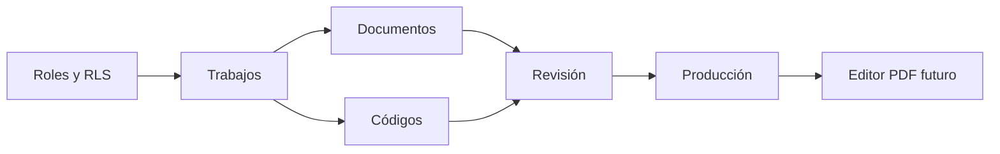

# 06 — Roadmap

## Criterio de planificación

El roadmap se organiza por resultados verificables. Las fechas se asignarán cuando el equipo confirme capacidad, dependencias y requisitos. No se promete una fecha basándose únicamente en una lista de funciones.

## Fase 0 — Fundamentos

**Resultado:** repositorio ejecutable y conexión segura con Supabase.

- [x] Crear proyecto Next.js.
- [x] Instalar clientes de Supabase.
- [x] Crear páginas iniciales de login y dashboard.
- [x] Iniciar migraciones de perfiles y roles.
- [ ] Documentar configuración local.
- [ ] Confirmar entornos y estrategia de ramas.

## Fase 1 — Identidad y autorización

**Resultado:** cada usuario entra y solo puede realizar acciones permitidas.

- [ ] Inicio y cierre de sesión completos.
- [ ] Renovación de sesión y protección de rutas.
- [ ] Perfiles activos.
- [ ] Roles definitivos.
- [ ] Políticas RLS y pruebas negativas.
- [ ] Administración inicial de usuarios.

Hito: un técnico no puede consultar datos de otro técnico y un usuario sin sesión no accede al portal.

## Fase 2 — Trabajos

**Resultado:** oficina crea, consulta, filtra y asigna trabajos.

- [ ] Esquema de trabajos.
- [ ] Esquema de asignaciones.
- [ ] Listado y filtros.
- [ ] Detalle y edición.
- [ ] Estados e historial.
- [ ] Panel básico por rol.

Hito: un trabajo pasa de borrador a asignado con trazabilidad.

## Fase 3 — Campo y documentos

**Resultado:** el técnico ejecuta y documenta el trabajo desde móvil.

- [ ] Buckets privados.
- [ ] Carga y visualización de PDF.
- [ ] Fotografías y evidencias.
- [ ] Catálogo de códigos.
- [ ] Cantidades y notas.
- [ ] Experiencia móvil validada.

Hito: un técnico entrega un trabajo completo para revisión.

## Fase 4 — Revisión y producción

**Resultado:** supervisión aprueba o devuelve y producción recibe información válida.

- [ ] Cola de revisión.
- [ ] Comentarios de corrección.
- [ ] Aprobación auditada.
- [ ] Bloqueo y reapertura controlada.
- [ ] Vista de producción.
- [ ] Exportación básica autorizada.

Hito: flujo de extremo a extremo completado por usuarios reales de prueba.

## Fase 5 — Lanzamiento del MVP

- [ ] Pruebas E2E críticas.
- [ ] Revisión de seguridad.
- [ ] Prueba piloto.
- [ ] Correcciones de prioridad alta.
- [ ] Documentación y capacitación.
- [ ] Despliegue productivo.
- [ ] Monitoreo inicial.

## Después del MVP

### Versión 1.1

- Notificaciones.
- Mejoras de búsqueda y reportes.
- Plantillas o duplicación de trabajos.
- Automatizaciones operativas pequeñas.
- Paneles de productividad.

### Versión 2.0 — Marcadores PDF

- Modelo de símbolos y marcadores.
- Coordenadas normalizadas por página.
- Herramientas de colocar, mover y eliminar.
- Versionado y colaboración controlada.
- Exportación de PDF marcado.
- Auditoría de cambios.

### Integraciones futuras

- QuickBooks.
- GPS y geocercas.
- Correo, SMS o push.
- Dashboard financiero.
- Analítica avanzada.

## Dependencias críticas

## Gestión de cambios

- Las funciones nuevas se comparan con los criterios del MVP.
- Todo cambio de seguridad requiere pruebas.
- Todo cambio de esquema requiere migración.
- Los hitos se cierran con demostración y evidencia, no solo con código escrito.
