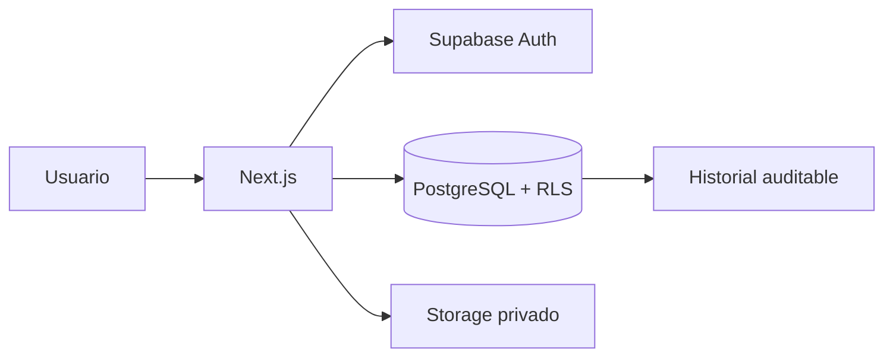

# Susotech Portal — Plan maestro del proyecto

## Estado del documento

| Campo | Valor |
|---|---|
| Proyecto | Susotech Portal |
| Versión | MVP v0.1 |
| Estado | En desarrollo |
| Última actualización | 2026-08-07 |
| Responsable | Equipo Susotech |
| Repositorio local | `C:\projects\susotech-portal` |

Este documento es la fuente principal para el alcance, la arquitectura y la ejecución del portal. Debe actualizarse cuando cambie una decisión relevante del producto o de la implementación.

## 1. Resumen ejecutivo

Susotech Portal será la plataforma interna para administrar trabajos de campo desde su creación hasta su revisión, aprobación y preparación para producción. Centralizará usuarios, asignaciones, documentos PDF, códigos de trabajo, fotografías, evidencias y estados operativos.

El MVP prioriza un flujo fiable y auditable. El editor visual de marcadores sobre PDF queda expresamente fuera del MVP: la primera versión permitirá almacenar y visualizar documentos, y dejará la arquitectura preparada para agregar anotaciones y exportaciones en una fase posterior.

## 2. Objetivos

### Objetivos del MVP

- Autenticar usuarios de forma segura.
- Aplicar permisos según el rol de cada usuario.
- Crear, consultar y actualizar trabajos.
- Asignar uno o varios técnicos a un trabajo.
- Subir y visualizar documentos PDF relacionados con el trabajo.
- Registrar códigos, cantidades, tarifas y evidencias.
- Adjuntar fotografías y otros archivos.
- Mantener un historial auditable de cambios de estado.
- Permitir revisión y aprobación antes de producción.
- Ofrecer una interfaz clara en escritorio y dispositivos móviles.

### Objetivos posteriores

- Añadir marcadores y anotaciones visuales sobre planos PDF.
- Exportar documentos con marcadores incorporados.
- Incorporar notificaciones y recordatorios.
- Integrar QuickBooks u otros sistemas financieros.
- Añadir funciones de GPS y operación de campo.
- Crear paneles financieros y de productividad.

## 3. Usuarios y roles

Los nombres definitivos pueden ajustarse durante la implementación, pero el modelo de permisos debe conservar la separación de responsabilidades.

| Rol | Responsabilidades principales |
|---|---|
| Administrador | Configuración, usuarios, roles, catálogos y acceso completo autorizado. |
| Coordinador / Oficina | Crear trabajos, asignar técnicos, administrar documentos y dar seguimiento. |
| Técnico | Consultar trabajos asignados, registrar códigos, fotos, evidencias y avances. |
| Revisor / Supervisor | Validar entregables, solicitar correcciones y aprobar trabajos. |
| Producción / Finanzas | Consultar trabajos aprobados, tarifas, cantidades y datos de producción. |

Principios:

- Ningún permiso sensible dependerá únicamente de la interfaz.
- La base de datos aplicará las reglas mediante Row Level Security (RLS).
- Cada acción crítica debe asociarse a un usuario y una fecha.
- El principio de mínimo privilegio será la configuración predeterminada.

## 4. Alcance funcional del MVP

### 4.1 Autenticación y perfiles

- Inicio y cierre de sesión.
- Recuperación de acceso, cuando se habilite el correo transaccional.
- Perfil vinculado al UUID de Supabase Auth.
- Nombre, apellidos, estado y rol de la persona.
- Bloqueo de rutas privadas para sesiones no autenticadas.

### 4.2 Gestión de trabajos

- Crear un trabajo con identificador único y datos básicos.
- Consultar listado y detalle.
- Filtrar por estado, cliente, fecha, técnico o texto.
- Editar únicamente los campos permitidos para cada rol.
- Asignar y reasignar técnicos conservando trazabilidad.
- Cambiar de estado siguiendo transiciones válidas.

Estados iniciales propuestos:

1. Borrador
2. Asignado
3. En progreso
4. En revisión
5. Requiere correcciones
6. Aprobado
7. En producción
8. Completado
9. Cancelado

### 4.3 Documentos y evidencias

- Subir el PDF principal y documentos complementarios.
- Visualizar el PDF en el navegador.
- Guardar archivos en buckets privados.
- Generar acceso temporal mediante URLs firmadas.
- Adjuntar fotografías y evidencias a un trabajo.
- Registrar autor, fecha, tipo, tamaño y relación con el trabajo.

### 4.4 Códigos, cantidades y tarifas

- Mantener un catálogo de códigos de trabajo.
- Registrar códigos ejecutados en cada trabajo.
- Capturar cantidades y notas.
- Separar tarifas de técnico y tarifas de cliente.
- Mantener historial o vigencia de tarifas cuando sea necesario.
- Evitar exponer información financiera a roles no autorizados.

### 4.5 Revisión y aprobación

- Enviar el trabajo a revisión.
- Aceptar o rechazar con comentario obligatorio cuando corresponda.
- Conservar el historial de estados y responsables.
- Bloquear cambios incompatibles después de la aprobación, salvo reapertura autorizada.

## 5. Fuera del alcance del MVP

- Editor visual de marcadores sobre PDF.
- Exportación de un PDF marcado.
- Sincronización completa con QuickBooks.
- Rastreo GPS en tiempo real.
- Nómina o facturación contable completa.
- Aplicaciones móviles nativas.
- Automatizaciones avanzadas de inteligencia artificial.

Estas exclusiones evitan ampliar el alcance antes de validar el flujo operativo central.

## 6. Arquitectura técnica

### Aplicación web

- **Next.js 16.3** con App Router.
- **React 19.2** para la interfaz.
- **TypeScript 5** con comprobaciones estrictas.
- **Tailwind CSS 4** para estilos.
- Componentes de servidor por defecto; componentes de cliente solo cuando sean necesarios.

### Plataforma de datos

- **Supabase Auth** para identidades y sesiones.
- **PostgreSQL** para datos relacionales.
- **Row Level Security** para autorización en la base de datos.
- **Supabase Storage** para PDF, fotografías y evidencias.
- Migraciones SQL versionadas en `supabase/migrations/`.

### Entrega

- **Git** y GitHub para control de versiones y revisión.
- **Vercel** como destino previsto de despliegue.
- Entornos separados para desarrollo, pruebas y producción cuando el proyecto lo requiera.

### Flujo lógico



## 7. Modelo de datos inicial

El esquema exacto se definirá mediante migraciones. Las entidades previstas son:

| Entidad | Propósito |
|---|---|
| `profiles` | Datos de perfil vinculados a `auth.users`. |
| `user_roles` | Roles asignados y su estado. |
| `jobs` | Registro principal de trabajos. |
| `job_assignments` | Relación entre trabajos y técnicos. |
| `work_codes` | Catálogo de códigos de trabajo. |
| `technician_rates` | Tarifas aplicables a técnicos. |
| `client_rates` | Tarifas aplicables a clientes. |
| `job_code_entries` | Códigos, cantidades y notas por trabajo. |
| `job_files` | Metadatos de PDF, fotos y evidencias. |
| `job_status_history` | Historial inmutable de estados. |
| `job_comments` | Conversación y observaciones operativas. |

Reglas de diseño:

- Usar UUID como identificadores públicos.
- Incluir `created_at`, `updated_at` y, cuando aplique, `created_by`.
- Usar claves foráneas y restricciones para proteger la integridad.
- Evitar borrados físicos de registros auditables; preferir archivado o estado.
- Definir índices a partir de filtros y relaciones reales.
- Mantener las migraciones acumulativas, revisables y reproducibles.

## 8. Seguridad

### Autorización

- Habilitar RLS en todas las tablas expuestas por Supabase.
- Crear políticas explícitas para lectura, creación, actualización y eliminación.
- Verificar pertenencia o asignación del usuario al trabajo.
- Reservar operaciones administrativas para roles autorizados.
- No incluir la clave `service_role` en el navegador ni en el repositorio.

### Archivos

- Usar buckets privados.
- Validar tipo MIME, extensión y tamaño.
- Organizar rutas por trabajo y categoría.
- Entregar archivos mediante URLs firmadas de duración limitada.
- No confiar en el nombre aportado por el usuario para construir rutas.

### Configuración

- Guardar secretos únicamente en variables de entorno.
- Mantener `.env.local` fuera de Git.
- Documentar las variables requeridas sin incluir sus valores.
- Usar proyectos o credenciales diferentes por entorno.

## 9. Estructura prevista del repositorio

```text
susotech-portal/
├── app/                       # Rutas, layouts y páginas de Next.js
│   ├── dashboard/
│   └── login/
├── src/
│   ├── components/            # Componentes reutilizables
│   ├── features/              # Módulos por capacidad del negocio
│   ├── lib/                   # Clientes, validaciones y utilidades
│   │   └── supabase/
│   └── types/                 # Tipos compartidos
├── supabase/
│   └── migrations/            # Cambios SQL versionados
├── public/                    # Recursos públicos no sensibles
├── docs/
│   └── PROJECT_PLAN.md        # Este documento
├── AGENTS.md                  # Reglas permanentes para asistentes
├── README.md                  # Instalación y uso rápido
└── package.json
```

La estructura debe crecer según necesidades reales. No se crearán abstracciones o carpetas vacías sin un consumidor concreto.

## 10. Convenciones de desarrollo

- TypeScript estricto; evitar `any` salvo justificación documentada.
- Nombres claros y consistentes en inglés para código y base de datos.
- Componentes pequeños con una responsabilidad definida.
- Lógica de negocio separada de la presentación.
- Validar datos en los límites del sistema, especialmente formularios y acciones del servidor.
- Manejar estados de carga, vacío, error y éxito.
- Proteger la accesibilidad: etiquetas, foco, teclado y contraste.
- No registrar secretos, tokens ni datos personales sensibles.
- Cada cambio de esquema debe incluir una migración.
- Antes de modificar APIs de Next.js, consultar la documentación incluida en la versión instalada, según `AGENTS.md`.

### Flujo Git

- Trabajar en ramas pequeñas por función o corrección.
- Hacer commits enfocados y descriptivos.
- No mezclar cambios de formato no relacionados.
- Revisar `git diff` y ejecutar comprobaciones antes de enviar cambios.
- No confirmar archivos `.env`, salidas de compilación ni dependencias instaladas.

## 11. Variables de entorno previstas

```dotenv
NEXT_PUBLIC_SUPABASE_URL=
NEXT_PUBLIC_SUPABASE_ANON_KEY=
```

Si se añaden credenciales exclusivamente de servidor, no deben usar el prefijo `NEXT_PUBLIC_`.

## 12. Experiencia de usuario

- Diseño simple, profesional y compatible con móvil.
- Navegación basada en tareas frecuentes.
- Panel inicial distinto según el rol cuando aporte valor.
- Formularios con mensajes claros y conservación segura del progreso.
- Tablas con búsqueda, filtros, paginación y acciones visibles.
- Estados y prioridades reconocibles sin depender únicamente del color.
- Confirmación para acciones irreversibles o sensibles.

## 13. Calidad y pruebas

### Comprobaciones mínimas por cambio

- Lint sin errores.
- Compilación de producción correcta.
- Prueba manual del camino feliz y del error principal.
- Verificación de permisos con más de un rol.
- Revisión de diseño en escritorio y móvil.

### Estrategia progresiva

- Pruebas unitarias para reglas puras y validaciones.
- Pruebas de integración para consultas y políticas críticas.
- Pruebas end-to-end para login, creación, asignación, evidencias y aprobación.
- Pruebas de RLS que demuestren tanto acceso permitido como denegado.

## 14. Despliegue y operación

1. Ejecutar migraciones en un entorno controlado.
2. Configurar variables de entorno en Vercel.
3. Verificar autenticación, RLS y Storage.
4. Ejecutar lint, build y pruebas críticas.
5. Desplegar una vista previa y validar el flujo principal.
6. Promover a producción con un plan básico de reversión.
7. Supervisar errores, uso y rendimiento después del lanzamiento.

No se aplicarán migraciones destructivas en producción sin respaldo, revisión y estrategia de recuperación.

## 15. Roadmap

### Fase 0 — Base del proyecto

- [x] Crear la aplicación Next.js.
- [x] Instalar Supabase para navegador y servidor.
- [x] Crear rutas iniciales de login y dashboard.
- [x] Iniciar migraciones de perfiles y roles.
- [ ] Completar configuración local documentada.

### Fase 1 — Usuarios y seguridad

- [ ] Completar autenticación y cierre de sesión.
- [ ] Proteger rutas privadas.
- [ ] Finalizar perfiles y roles.
- [ ] Implementar y probar políticas RLS.
- [ ] Crear administración básica de usuarios.

### Fase 2 — Trabajos y asignaciones

- [ ] Diseñar migraciones de trabajos y asignaciones.
- [ ] Crear listado, detalle y formulario de trabajo.
- [ ] Implementar filtros y búsqueda.
- [ ] Implementar flujo de estados e historial.

### Fase 3 — Documentos y campo

- [ ] Configurar buckets privados y políticas.
- [ ] Subir y visualizar PDF.
- [ ] Adjuntar fotografías y evidencias.
- [ ] Crear catálogo y captura de códigos.
- [ ] Optimizar la experiencia móvil.

### Fase 4 — Revisión y producción

- [ ] Implementar revisión y solicitudes de corrección.
- [ ] Implementar aprobación y bloqueo controlado.
- [ ] Crear vistas para producción y finanzas.
- [ ] Añadir reportes y exportaciones iniciales.

### Fase 5 — Evolución posterior al MVP

- [ ] Diseñar editor visual de marcadores sobre PDF.
- [ ] Guardar coordenadas, páginas, símbolos y metadatos.
- [ ] Exportar PDF con anotaciones.
- [ ] Añadir notificaciones.
- [ ] Evaluar integración con QuickBooks.
- [ ] Evaluar GPS, panel financiero y analítica avanzada.

## 16. Criterios de aceptación del MVP

El MVP estará listo cuando:

- Un usuario autorizado pueda iniciar sesión y acceder solo a las funciones de su rol.
- La oficina pueda crear un trabajo y asignarlo a un técnico.
- El técnico pueda ver sus trabajos y aportar códigos, fotos y evidencias.
- Los documentos PDF puedan subirse y visualizarse de forma segura.
- Un supervisor pueda revisar, solicitar correcciones y aprobar.
- El historial permita saber quién cambió el estado y cuándo.
- Las políticas RLS impidan el acceso no autorizado aunque se llame directamente a la API.
- El flujo principal funcione en móvil y escritorio.
- El proyecto compile, pase lint y tenga instrucciones de ejecución actualizadas.

## 17. Riesgos y mitigaciones

| Riesgo | Mitigación |
|---|---|
| Alcance excesivo | Mantener el editor PDF y las integraciones fuera del MVP. |
| Permisos incorrectos | Diseñar y probar RLS desde el inicio. |
| Pérdida de trazabilidad | Registrar estados, autores y fechas de forma inmutable. |
| Exposición de documentos | Buckets privados, validación y URLs firmadas. |
| Cambios de esquema inseguros | Migraciones versionadas, respaldos y revisión. |
| Experiencia de campo deficiente | Diseñar y probar primero los flujos móviles críticos. |
| Datos financieros visibles | Separar permisos y consultas por rol. |

## 18. Decisiones registradas

1. Next.js, React, TypeScript y Tailwind forman la base de la interfaz.
2. Supabase aporta autenticación, PostgreSQL, RLS y almacenamiento.
3. Vercel es el destino previsto para el despliegue web.
4. La seguridad se aplica en la base de datos, no solo en la interfaz.
5. Los archivos operativos se almacenan de forma privada.
6. El MVP incluye visualización de PDF, pero no edición visual ni marcadores.
7. El editor de marcadores debe poder añadirse después sin bloquear el MVP.
8. Las migraciones SQL son la fuente de verdad del esquema.

## 19. Próximos pasos inmediatos

- [ ] Revisar las migraciones actuales de perfiles y roles.
- [ ] Confirmar la lista definitiva de roles y permisos.
- [ ] Completar el flujo de autenticación.
- [ ] Proteger `/dashboard` y demás rutas privadas.
- [ ] Diseñar la migración inicial de trabajos.
- [ ] Definir buckets y límites de archivo.
- [ ] Actualizar el README con la configuración local real.
- [ ] Añadir pruebas iniciales de autorización.

## 20. Mantenimiento de este documento

- Actualizar la fecha y la versión cuando cambie el alcance.
- Registrar decisiones que afecten arquitectura, seguridad o datos.
- Marcar tareas únicamente cuando estén verificadas.
- Mover detalles extensos a documentos especializados cuando el proyecto crezca, manteniendo aquí enlaces y el resumen vigente.
- Revisar este plan al inicio de cada fase y antes de declarar terminado el MVP.
